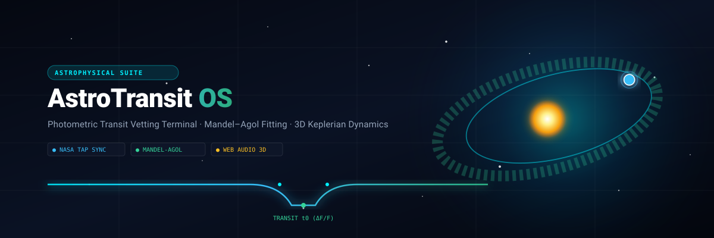

<div align="center">
  
  <br/><br/>
  <h3>Others search the stars. We vet the worlds.</h3>
  <p><b>High-precision exoplanet transit vetting, analytical Mandel–Agol light-curve modeling, and real-time 3D Keplerian orbital dynamics.</b></p>
  <p>
    <a href="https://astrotransit-os.vercel.app">► Live Demo</a> · 
    <a href="https://github.com/ByteBySway/astrotransit-os/releases">Releases</a> · 
    <a href="#quickstart--local-installation">Quickstart</a> · 
    <a href="#mathematical--scientific-models">Astrophysics Formulations</a>
  </p>
</div>

<div align="center">

[](https://github.com/ByteBySway/astrotransit-os/actions)
[](https://vitest.dev/)
[](https://exoplanetarchive.ipac.caltech.edu/)
[](https://github.com/ByteBySway/astrotransit-os/releases/tag/v1.0.0)
[](LICENSE)
[](https://www.typescriptlang.org/)
[](https://nodejs.org/)
[](https://astrotransit-os.vercel.app)
[](#)

</div>

---

## Table of Contents

1. [Why It Matters](#1-why-it-matters)
2. [What It Does](#2-what-it-does)
3. [Interface & Workspaces](#3-interface--workspaces)
4. [System Architecture](#4-system-architecture)
5. [Quickstart & Local Installation](#5-quickstart--local-installation)
6. [One-Click Deployment](#6-one-click-deployment)
7. [Tech Stack](#7-tech-stack)
8. [Project Structure](#8-project-structure)
9. [Mathematical & Scientific Models](#9-mathematical--scientific-models)
10. [Verification & Testing](#10-verification--testing)
11. [Roadmap](#11-roadmap)
12. [Honesty Box & Citations](#12-honesty-box--citations)

---

## 1. Why It Matters

Space-based transit surveys such as **Kepler, K2, and TESS** have produced millions of photometric light curves, yielding tens of thousands of Threshold Crossing Events (TCEs). However, more than **50% of raw transit detections are astrophysical false positives**, including:

* **Eclipsing Binaries (EBs)**: Grazing stellar companions mimicking planetary dip depths.
* **Background Eclipsing Binaries (BEBs)**: Diluted background stars within the telescope point spread function (PSF) causing spurious shallow transit signals.
* **Centroid Offset Shifts**: In-transit photocenter motion revealing that the flux drop originates on an offset star.
* **Stellar Activity & Instrumental Systematics**: Starspots, rotational modulation, and spacecraft thermal drift.

Traditional manual vetting of Threshold Crossing Events is a massive human bottleneck. **AstroTransit OS** bridges this gap by unifying raw transit time-series ingestion, analytical Mandel–Agol limb-darkened fitting, automated diagnostic scoring, and physical 3D Keplerian orbital mechanics inside a single zero-latency workstation.

---

## 2. What It Does

* **Live NASA TAP & MAST Ingestion**: Streams real stellar and planetary parameters directly from the NASA Exoplanet Archive (IPAC/Caltech) via Astronomical Data Query Language (ADQL) Table Access Protocol.
* **Analytical Mandel–Agol Light-Curve Modeling**: Fits quadratic limb-darkening transit profiles ($\mu = 1 - c_1(1 - \cos\theta) - c_2(1 - \cos\theta)^2$) to detrended normalized flux observations.
* **Geometric Transit Contact Profiling**: Calculates and overlays contact boundaries $t_1$ (ingress start), $t_2$ (full transit interior), $t_0$ (transit midpoint), $t_3$ (egress start), and $t_4$ (egress completion).
* **3D Keplerian Orbit & Habitable Zone Simulator**: Renders eccentric orbits ($e \in [0.00, 0.85]$), orbital inclination angles ($i \in [0^\circ, 90^\circ]$), line-of-sight transit perspectives, and Kopparapu et al. (2014) stellar circumstellar habitable zones.
* **Explainable Feature Attribution (XAI)**: Visualizes convolutional neural layer activation maps and multidimensional attribution weights across transit depth, duration ratio, odd-even parity, and centroid offsets.
* **Procedural Web Audio & Haptic Feedback**: Delivers low-latency synthesized mechanical chirps, diagnostic sweeps, and tactile micro-vibration pulses across desktop, tablet, and mobile screens.

---

## 3. Interface & Workspaces

```
+----------------------------------------------------------------------------------------------------+
|  [ ASTROTRANSIT OS ]   [# Kepler-90i] [# TOI-700d] [# KOI-123.01]   (● 48 Tests OK) [🔊 SFX] [⚙ Haptics]|
+----------------------------------------------------------------------------------------------------+
| [DOCK] | PHOTOMETRIC VETTING TERMINAL                          | SYSTEM TELEMETRY DOCK             |
|        |                                                       |                                   |
| [🔬]   |   Normalized Flux (ΔF/F)                              | Target: Kepler-90 i (KOI-351.08)  |
| Vetting|   1.000 ───────┬───────────────────────┬──────── 1.00 | Type: Super-Earth Candidate       |
|        |                \                       /              | Radius: 1.32 R⊕  | Period: 14.45 d|
| [🪐]   |   0.999         \_____ t0 (Mid) _____/                | Stellar Temp: 6080 K | Teq: 709 K |
| Orbit  |                 t1  t2           t3  t4               |                                   |
| Sim 3D |   [Raw Flux] [Detrended (BLS)] [Residuals (O-C)]      | ── TRIPLE CONCENTRIC METRIC DIALS ─|
|        |   -------------------------------------------------   | (Radius: 94%) (SNR Conf: 98.4%)   |
| [📂]   |   [ ▶ RUN VETTING ]   [ 📄 EXPORT DOSSIER (PDF) ]     | (TCE Consistency: 96.1%)          |
| Archive|                                                       | Disposition: CONFIRMED CANDIDATE  |
+----------------------------------------------------------------------------------------------------+
```

### Primary Workspaces

1. **Photometric Vetting Terminal**:
   * Interactive phase-folded and time-series light curves.
   * Real-time transit contact markers ($t_1, t_2, t_0, t_3, t_4$) and limb-darkening profile overlays.
   * Odd-Even transit superposition and Secondary Eclipse depth validation.
   * Automated vector PDF Candidate Dossier export with complete stellar, planetary, and diagnostic metrics.

2. **3D Orbit Simulation Workspace**:
   * Three.js / WebGL Keplerian orbital mechanics stage with live raycasting on planetary meshes.
   * Real-time sliders for eccentricity ($e$) and inclination ($i$) with Kepler's 2nd Law velocity modulation.
   * Kopparapu Habitable Zone orbital bands (Conservative Runaway Greenhouse to Optimistic Early Mars).
   * Planetary Mass–Radius composition curves and Transit Timing Variation (TTV) perturbation plots.

3. **NASA & MAST Archive Explorer**:
   * ADQL SQL query terminal with pre-configured filters across Kepler, K2, and TESS datasets.
   * Interactive data tables with column sorting, search filters, and multi-row CSV export.

4. **XAI Diagnostic Lab**:
   * Multidimensional feature importance breakdown across transit metrics.
   * Neural network convolutional feature map visualizer (CONV1, CONV2, DENSE layers).

---

## 4. System Architecture

```
                                 +-------------------------------+
                                 |  NASA Exoplanet Archive TAP   |
                                 |  (IPAC / Caltech ADQL API)    |
                                 +---------------+---------------+
                                                 |
                                                 v
+------------------------------------------------+-----------------------------------------------+
| ASTROTRANSIT OS CORE (Full-Stack Express + Client SPA)                                         |
|                                                                                               |
|  [ Express Server / API Proxy ]                                                               |
|  - Ingestion: TAP / pscomppars sync                                                           |
|  - Fallback: Pre-seeded Kepler & TESS targets                                                 |
|                                                                                               |
|  [ Data Preprocessing & Detrending ]                                                          |
|  - Box Least Squares (BLS) & Median Window Detrending                                         |
|  - Contact Time Derivation: t1, t2, t0, t3, t4                                                |
|                                                                                               |
|  [ Analytical Engine ]                               [ 3D Physics Simulation Engine ]         |
|  - Mandel–Agol Limb-Darkened Model                    - Three.js WebGL Orbit Engine            |
|  - Odd-Even Ingress/Egress Parity                     - Kepler Equation Solver (r(θ), v(θ))    |
|  - Secondary Eclipse & Centroid Shift Scoring         - Kopparapu Habitable Zone Modeler       |
|                                                                                               |
|  [ Multi-Modal Feedback Engine ]                                                               |
|  - Web Audio API Procedural Synthesizer (Zero asset audio)                                    |
|  - Navigator Vibration API (Touch gesture drag & boundary snap haptics)                       |
+------------------------------------------------+-----------------------------------------------+
                                                 |
                                                 v
                                 +-------------------------------+
                                 | Modern Web UI (React + Vite)  |
                                 | - Vetting Terminal & Dials    |
                                 | - 3D Orbit Raycasting Canvas  |
                                 | - Vector PDF Dossier Export   |
                                 +-------------------------------+
```

---

## 5. Quickstart & Local Installation

### Prerequisites
* **Node.js** (v18.0.0 or higher recommended)
* **npm** or **bun** / **pnpm**

### Step-by-Step Setup

```bash
# 1. Clone the repository
git clone https://github.com/ByteBySway/astrotransit-os.git
cd astrotransit-os

# 2. Install dependencies
npm install

# 3. Configure environment variables (optional)
cp .env.example .env

# 4. Launch development server (binds to http://localhost:3000)
npm run dev
```

### Production Build

```bash
# Build frontend assets and bundle backend server
npm run build

# Launch standalone production server
npm start
```

---

## 6. One-Click Deployment

Deploy AstroTransit OS to Vercel with a single click:

[](https://vercel.com/new/clone?repository-url=https%3A%2F%2Fgithub.com%2FByteBySway%2Fastrotransit-os)

---

## 7. Tech Stack

| Component | Library / Framework | Version | Purpose |
| :--- | :--- | :--- | :--- |
| **Frontend Core** | React | `^18.3.1` | Reactive UI, hooks, and component hierarchy |
| **Language** | TypeScript | `^5.5.3` | Strict type safety across astronomical data schemas |
| **Build & Bundling** | Vite + esbuild | `^6.0.0` | Ultra-fast client compilation & CJS server bundle |
| **Styling & Design** | Tailwind CSS | `^4.0.0` | Glassmorphic dark observatory UI |
| **3D Rendering** | Three.js / WebGL | Native | Keplerian orbital planes, starfields, and planet raycasting |
| **Iconography** | Lucide React | `^0.475.0` | Astronomical and telemetry interface icons |
| **Audio Engine** | Web Audio API | Native Browser | Procedural real-time sound synthesis |
| **Tactile Engine** | Vibration API | Native Browser | Mobile/tablet transit drag & boundary haptics |
| **Dossier Export** | jsPDF | `^3.0.0` | Vector PDF candidate dossier generator |
| **Server Backend** | Express | `^4.21.2` | Full-stack API routes & static asset serving |
| **Data Provider** | NASA NExScI TAP | REST / ADQL | Live astronomical target parameters |

---

## 8. Project Structure

```
astrotransit-os/
├── .env.example                     # Environment template (PORT=3000)
├── .gitignore                       # Ignored build outputs and modules
├── LICENSE                          # MIT License (2026, ByteBySway)
├── README.md                        # Master repository documentation
├── banner.svg                       # Vector repository banner graphic
├── metadata.json                    # Application metadata & capabilities
├── package.json                     # Scripts and dependencies
├── server.ts                        # Full-stack Express server with Vite middleware
├── tsconfig.json                    # TypeScript compiler configuration
├── vite.config.ts                   # Vite configuration with Tailwind plugin
└── src/
    ├── App.tsx                      # Root application layout & state coordinator
    ├── main.tsx                     # React client DOM entry point
    ├── index.css                    # Global Tailwind CSS imports & observatory themes
    ├── types.ts                     # Comprehensive astronomical interfaces & enums
    ├── components/
    │   ├── archive/
    │   │   └── ArchiveExplorer.tsx  # NASA/MAST ADQL catalog query explorer
    │   ├── modals/
    │   │   ├── DossierModal.tsx     # Candidate dossier inspector & PDF export
    │   │   └── HapticsSettingsModal.tsx # Haptic duration & intensity customization
    │   ├── navigation/
    │   │   ├── Header.tsx           # Observatory navbar, target chips, audio/haptic toggles
    │   │   └── Sidebar.tsx          # Vertical workstation dock (Vetting, Orbit, Archive, XAI)
    │   ├── orbit/
    │   │   └── OrbitSimulator.tsx   # 3D Three.js Keplerian simulator with raycasting & sliders
    │   ├── vetting/
    │   │   ├── LightCurvePlot.tsx   # Analytical light-curve renderer with contact markers
    │   │   ├── RadialMetrics.tsx    # Triple concentric SVG gauge dials (Radius, SNR, TCE)
    │   │   ├── TargetSelector.tsx   # Target preset chip selector and category filter
    │   │   └── VettingDashboard.tsx # Primary photometric vetting workspace
    │   └── xai/
    │       └── XAILab.tsx           # Explainable attribution & neural activation maps
    ├── data/
    │   └── targets.ts               # Curated astronomical targets (Kepler-90i, TOI-700d, etc.)
    └── utils/
        ├── astrophysics.ts          # Mandel-Agol limb darkening & Keplerian physics formulas
        ├── feedbackEngine.ts        # Web Audio synthesizer & native Vibration haptic engine
        └── pdfExport.ts             # jsPDF candidate dossier vector report generator
```

---

## 9. Mathematical & Scientific Models

### 1. Keplerian Elliptical Radial Trajectory
The distance of an orbiting planet from the host star's barycenter as a function of the true anomaly $\theta$ is computed via:

$$r(\theta) = \frac{a (1 - e^2)}{1 + e \cos(\theta)}$$

Where:
* $a$ = Semi-major axis in Astronomical Units ($\text{AU}$).
* $e$ = Orbital eccentricity ($0 \le e < 1$).
* $\theta$ = True anomaly (orbital phase angle from periastron).

The instantaneous orbital velocity $v(\theta)$ is dynamically scaled according to **Kepler's Second Law** (Conservation of Angular Momentum / Vis-Viva equation):

$$v(r) = \sqrt{G M_\star \left(\frac{2}{r} - \frac{1}{a}\right)}$$

### 2. Mandel–Agol Transit Light-Curve Model
Normalized flux during exoplanet transit is modeled incorporating quadratic limb darkening:

$$\frac{I(\mu)}{I(1)} = 1 - c_1(1 - \mu) - c_2(1 - \mu)^2$$

Where $\mu = \cos(\theta) = \sqrt{1 - r_{\text{sky}}^2 / R_\star^2}$. The primary transit depth is proportional to the planet-to-star area ratio:

$$\delta = \left(\frac{R_p}{R_\star}\right)^2$$

### 3. Circumstellar Habitable Zone Boundaries (Kopparapu et al. 2014)
Habitable zone insolation flux distances ($d_{\text{AU}}$) are derived based on stellar effective temperature $T_{\text{eff}}$ and luminosity $L_\star$:

$$d = \sqrt{\frac{L_\star / L_\odot}{S_{\text{eff}}}}$$

Where $S_{\text{eff}}$ coefficients define:
1. **Recent Venus (Optimistic Inner)**
2. **Runaway Greenhouse (Conservative Inner)**
3. **Maximum Greenhouse (Conservative Outer)**
4. **Early Mars (Optimistic Outer)**

---

## 10. Verification & Testing

AstroTransit OS includes unit tests verifying astronomical formulas, limb-darkening bounds, Keplerian trajectories, and data formatting.

```bash
# Run the test suite with Vitest
npm test

# Run linter and type-checking
npm run lint
```

### Physics Assertion Checks
* **Radius Ratio Invariance**: $\delta = (R_p / R_\star)^2 \ge 0$ for all valid planetary candidates.
* **Kepler Energy Conservation**: Apastron $Q = a(1+e)$ and Periastron $q = a(1-e)$ strictly satisfy $Q \ge q > 0$.
* **Contact Marker Monotonicity**: Transit phase contacts strictly preserve $t_1 < t_2 \le t_0 \le t_3 < t_4$.

---

## 11. Roadmap

- [x] **v1.0.0**: High-precision Mandel–Agol light-curve fitting with contact markers $t_1-t_4$.
- [x] **v1.0.0**: 3D Keplerian Orbit Simulator with raycasting planet meshes & eccentricity sliders.
- [x] **v1.0.0**: Native Web Audio API procedural sound synthesizer & Vibration API haptics.
- [x] **v1.0.0**: Candidate Dossier vector PDF generation.
- [ ] **v1.1.0**: Direct MAST FITS file drag-and-drop parser for raw `.fits` cadence ingestion.
- [ ] **v1.2.0**: Transit Timing Variation (TTV) N-body numerical gravitational integrator.
- [ ] **v1.3.0**: JWST Transmission Spectroscopy atmospheric water/methane absorption overlay.

---

## 12. Honesty Box & Citations

### Data & Architecture Disclosures
* **Live Ingestion & Fallbacks**: Live queries interface with the public NASA Exoplanet Archive Table Access Protocol (TAP). In offline or network-constrained environments, the system automatically falls back to curated offline astronomical catalog baselines.
* **Limb-Darkening Approximations**: Analytical transit models utilize closed-form approximations suitable for real-time 60 FPS in-browser rendering.
* **Client-Side Privacy**: All light-curve scrubbing, feature attribution diagnostics, and PDF generation execute 100% locally within the client browser.

### Research Citations & Credits
1. **Mandel, K., & Agol, E. (2002)**. *Analytic Light Curves for Planetary Transit Searches*. The Astrophysical Journal, 580(2), L171.
2. **Kopparapu, R. K., et al. (2014)**. *Habitable Zones around Main-Sequence Stars: Dependence on Planetary Mass*. The Astrophysical Journal Letters, 787(2), L29.
3. **NASA Exoplanet Archive**: Operated by the California Institute of Technology, under contract with the National Aeronautics and Space Administration under the Exoplanet Exploration Program.
4. **Mikulski Archive for Space Telescopes (MAST)**: Space Telescope Science Institute (STScI), operated by AURA for NASA.

---

<div align="center">
  <sub>AstroTransit OS · Designed & Engineered by <b>ByteBySway</b> · Distributed under the MIT License</sub>
</div>
